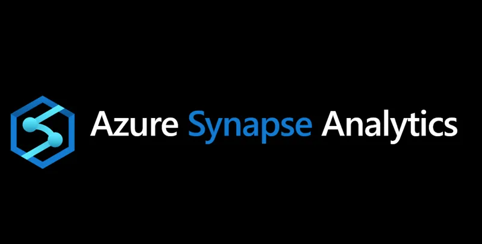

## Querying Azure data-lake storage

## 

## 1 Login on Azure

You can request an Azure subscription from IT. After activation you can log in to your new empty subscription. For this training we have created an empty subscription that we will all work in. *You will have received an email from the system to login for today.*

**Start the process**

* Login to [https://Portal.azure.com](https://Portal.azure.com) 

## 

## 2 Create a resource group

Within the subscription you can create separate groups to group parts and systems. In this workshop each participant creates his own resource so that the participants do not get in each other's way.

* Open the Azure portal, in the search bar enter ‘**resource groups**’ without hitting enter.

* In the search results, under **Services**, select **Resource group**

* Select add/create to create a resource group

* Subscription - choose our workshop subscription

* Resource group name - use your wurid without @wur.nl

* Region - Europe West

* Review & create - wait until Azure created the new resource

## 3 Create a storage container

A data lake storage is a service to store unstructured data. Data-lake storage is unlimited scalable and has a very high availability. Data-lake storage is an unmanaged storage. With a SQL server, the (DataBase Management System) DBMS is responsible for the content of the data. The data lake is only responsible for availability.

* In the search bar enter ‘**storage accounts’** without hitting enter.

* In the search results, under Services, select **storage accounts**

* Select Add/create to create a** storage account**

* Basics tab

    * Subscription - choose our workshop subscription 

    * Resource group - choose your resource group

    * Name -  pick any globally unique name, in this tutorial, use your WurID

    * Region -  Europe West

    * Performance - standard

    * Availability - locally redundant storage (LRS)

* Advanced tab

    * Enable hierarchical namespace - [X] Check: 

* Review & Create  - wait until Azure created the new resource

## 4 Activate Azure Synapse analytics

Azure Synapse Analytics is a limitless analytics service that brings together data integration, data warehousing, and big data analytics. Synapse analytics is a program on Azure that allows you to run queries directly on a data lake with SQL or Spark.

* In the search bar enter ‘**Azure synapse analytics**’ without hitting enter.

* In the search results, under Services, select **Azure synapse analytics**

* Select Add to create a** Azure synapse analytics **

* Basics tab - Project details

    * Subscription - choose our workshop subscription 

    * Resource group - choose your resource group 

    * Managed Resource group - leave this blank

* Basics tab - Workspace details

    * Region -  West Europe

    * Select data lake storage gen2

    * Select data lake gen2 - [X] From subscription

    * Account name - your storage account name 

    * File system name 

        * create new 

        * name - wurid

* Security tab

    * Password - Choose your own password & confirm

* Review & Create - While Azure is deploying the service we can follow the next step.

	

## 5 Download some dairy data

For this session we created some test-data-sets from the RIC feeding bins on Dairy Campus. The dataset contains real time weighings of the feeding bins. There are two datasets available, large one  200MB with 30 million rows and a small one 10Mb . After choosing large or small you can download the data from our public available data-lake.

The small files are in CSV format, for the large files I compressed the data with Pandas in the Parquet format. 

* Open a new tab in your browser

* Download two large or small files

* Large +-200 MB + 30 million rows

    * [https://workshopwlrdata.blob.core.windows.net/data/2020.parquet](https://workshopwlrdata.blob.core.windows.net/data/2020.parquet)

    * [https://workshopwlrdata.blob.core.windows.net/data/2021.parquet](https://workshopwlrdata.blob.core.windows.net/data/2021.parquet)

* Small	

    * [https://workshopwlrdata.blob.core.windows.net/data/2020-01-01.csv](https://workshopwlrdata.blob.core.windows.net/data/2020-01-01.csv)

    * [https://workshopwlrdata.blob.core.windows.net/data/2021-01-01.csv](https://workshopwlrdata.blob.core.windows.net/data/2020-01-01.csv)

* After downloading the data we wait until Azure created Synapse analytics

## 6 Open synapse analytics

* In the search bar enter ‘**synapse analytics**’ without hitting enter.

* In the search results, under Services, select **synapse analytics**

* Select open your **synapse analytics **installation

* Open synapse analytics

* Open synapse studio

## 7 Open Data lake in Synapse analytics & upload data

There are many different ways to upload data into the data lake. For this workshop we keep it simple and upload data in Synapse analytics.

* Data

* Linked

* Open data lake

* Open container

* Click on upload

* Select the files you just downloaded and upload to your Data Lake

## 8 "Write" your first data-lake-SQL-query

* Right click your just uploaded data 

* New SQL script

* Select top 100 rows

* Run the generated query, and receive the results

# 9 Modify query for aggregating & count rows

* Remove the columns, and leave the date or c1 column

* add ,count(*) after date or c1 when using the CSV file

* add group by date or c1 when using the CSV file

* Run the query (again)

## 10 Modify query for query all the files

* Replace the filename with an asterix

* Run the query and receive the aggregated results of all the files

Part 2

## 2.1 Run a Spark-Notebook on the data lake

Apache Spark is a lightning-fast unified analytics engine for big data and machine learning. Spark uses Resilient Distributed Datasets (RDD) to perform parallel processing across a cluster or computer processors. Spark is made for large data sets. Spark is relatively slow with small data sets.

* Go to the data overview (WurID tab)

* Right click on a data file

* New notebook

* Load to DataFrame

## 2.2 Deploy a Spark cluster

Because the Spark Query is running on other servers, we have to deploy a spark cluster.

* Select attach to

* Manage pools

* Create new spark pool

* Apache spark pool name - fill in WURID

* Node size - choose for the smallest nodes (Ram/CPU)

* Autoscale disable autoscaling

* Review & create

* Click on data again

* Select your just generated cluster

## 2.3 Attach notebook to spark cluster

* Click on run and wait for cluster to start

## 2.4 Change some code to aggregate all the files 

Now you received the first query result. Depending on the files you’re using you have to change some code.

* If you’re using the CSV  files remove the two green dashes for header

* add:

    * df2 = df.selectExpr('date').groupBy('date').count()

    * display(df2)

