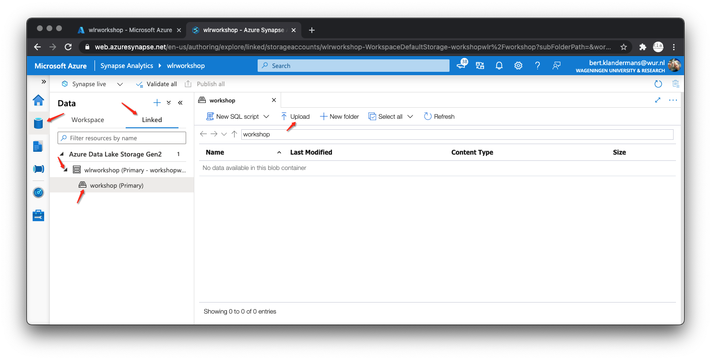

An introduction on Azure data-lake storage

## 1 Login on Azure

In Azure you work on a subscription. You can request a subscription from IT. After activation you can log in to your new empty subscription. For this training we have created an empty subscription that we will all work in.

* Login

    * Portal.azure.com

## 

## 2 Resource groep aanmaken

Within the subscription you can create separate groups to group parts and systems. In this workshop each participant creates his own resource group.

* Create resource group

    * Home

    * + create resource

        * Choose resource group

        * Create

    * Use your wurid without @wur.nl as resource group name

    * Choose: Europe west

    * Review & create

    * Wait until Azure created the new resource

## 3 Create a storage container

A data lake storage is a place to store unstructured data. Data-lake storage is unlimited scalable and has a very high availability. Data-lake storage is unmanaged storage. With a SQL server, the DBMS is responsible for the content of the data. The data lake is only responsible for availability.

* Create storage account

    * Home

    * + create resource

        * Choose storage account

        * Create

    * Basics

        * Choose our Subscription

        * Choose your own resource group

        * Give your storage account a name, choose your WurID

        * Region: Europe West

        * Performance: Standard

        * Availability: Locally redundant

    * Advanced

        * [X] Check: Enable hierarchical namespace

    * Review & Create

## 4 Activate Synapse analytics

Synapse analytics is een programma op azure waarmee je direct op een data-lake queries kan draaien net SQL of met Spark.

* Home

* + create resource

    * Choose Synapse analytics

* Basics

    * Subscription

        * ResourceGroep: WurID

        * WorkspaceName:WurID

    * Workspace details

        * Region: West Europe

        * Select data lake storage gen2

    * Select data lake gen2

        * [X] From subscription

        * Account name: WurID

        * File system name: WurID (Create new)

* Security

    * Password

        * Choose your own password & confirm

* Review & Create

	

## 5 Download dairy data

For this session we created some test-data-sets. You can download the data from our public available data-lake. 

* Open a new tab in your browser

* Copy & paste url URL TO BE LATER CREATED

* Download data to your disk & unzip

## 6 Open synapse analytics

* Home

* Search your resource group with search function

* Click on your synapse analytics installation

* Click on open synapse studio

## 7 Open Data lake in Syapse analytics

* Data

* Linked

* Open data lake

* Open container

* Click on upload

* Select the files you just downloaded and upload

## 8 "Write" your first data-lake-SQL-query

* Right click your just uploaded data 

* New SQL script

* Select top 100 rows

* Run the generated query

# 9 Modify query for aggregating & count rows

* Remove the columns and add count(*)

* Run the query

## 10 Modify query for query all the files

* replace the filename with an asterix

* Run the query

Part 2

## 2.1 Run a Spark-Notebook on the data lake

* Click on data again

* Select your just generated cluster

* Click on run and wait for the cluster is started

* Change some code to aggregrate all the files 

